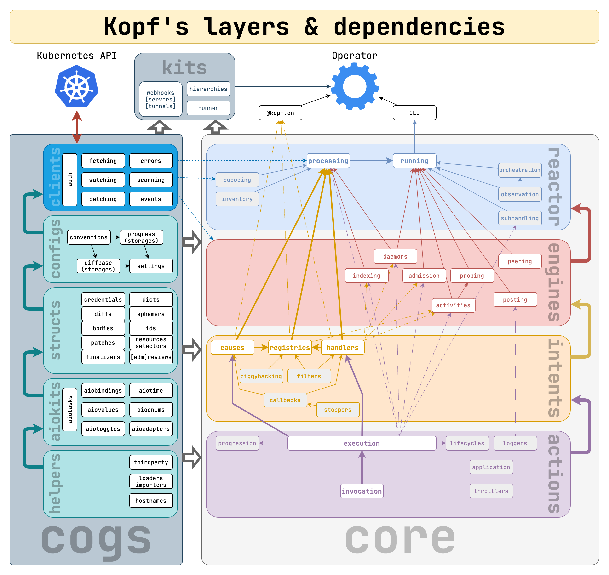

============
Architecture
============

Layered layout
==============

The framework is organized into several layers, and the layers are layered too.
The higher-level layers and modules can import the lower-level ones,
but not vice versa. The layering is checked and enforced by `import-linter`_.

.. _import-linter: https://github.com/seddonym/import-linter/

   Note: only the essential module dependencies are shown, not all of them.
   All other numerous imports are represented by cross-layer dependencies.

.. Drawn with https://diagrams.net/ (ex-draw.io; desktop version).
.. The source is here nearby. Export as PNG, border width 0, scale 200%,
.. transparent background ON, include copy of the diagram OFF.

Root
----

At the topmost level, the framework consists of cogs, core, and kits,
and user-facing modules.

``kopf``, ``kopf.on``, ``kopf.testing`` are the public interface that can be
imported by operator developers. Only these public modules contain all public
promises on names and signatures. Everything else is an implementation detail.

The internal modules are intentionally hidden (by underscore-naming)
to protect against introducing the dependencies on the implementation details
that can change without warnings.

``cogs`` are utilities used throughout the framework in nearly all modules.
They do not represent the main functionality of operators but are needed
to make them work. Generally, the cogs are fully independent of each other
and of anything in the framework --- to the point that they can be extracted
as separate libraries (in theory; if anyone needs it).

``core`` is the main functionality used by a Kopf-based operator.
It brings the operators into motion. The core is the essence of the framework,
it cannot be extracted or replaced without redefining the framework.

``kits`` are utilities and specialised tools provided to operator developers
for some scenarios and/or settings. The framework itself does not use them.

Cogs
----

``helpers`` are system-level or language-enhancing adapters. E.g., hostname
identification, dynamic Python module importing, integrations with 3rd-party
libraries (such as pykube-ng or the official Kubernetes Python client).

``aiokits`` are asynchronous primitives and enhancements for ``asyncio``,
sufficiently abstracted from the framework and the Kubernetes/operator domains.

``structs`` are data structures and type declarations for Kubernetes models:
such as resource kinds, selectors, bodies or their parts (specs, statuses, etc),
admission reviews, so on. Besides, this includes some specialised structures,
such as authentication credentials -- also abstracted for the framework even
in case the clients and their authentication are replaced.

``configs`` are the settings mostly, and everything needed to define them:
e.g. persistence storage classes (for handling progress and diff bases).

``clients`` are the asynchronous adapters and wrappers for the Kubernetes API.
They abstract away how the framework communicates with the API to achieve
its goals (such as patching a resource or watching for its changes).
Currently, it is based on aiohttp_; previously, it was the official Kubernetes
client library and pykube-ng. Over time, the whole clients' implementation
can be replaced with another one --- while keeping the signatures for the rest
of the framework. Only the clients are allowed to talk to the Kubernetes API.

.. _aiohttp: https://github.com/aio-libs/aiohttp

Core
----

``actions`` is the lowest level in the core (but not in the framework).
It defines how the functions and handlers are invoked, which ones specifically,
how their errors are handled and retried (if at all), how the function results
and the patches are applied to the cluster, so on.

``intents`` are mostly data structures that store the declared handlers
of the operators, but also some logic to select/filter them when a reaction
is needed.

``engines`` are specialised aspects of the framework, i.e. its functionality.
Engines are usually independent of each other (though, this is not a rule).
For example, daemons and timers, validating/mutating admission requests,
in-memory indexing, operator activities (authentication, probing, etc),
peering, Kubernetes ``kind: Event`` delayed posting, etc.

``reactor`` is the topmost layer in the framework. It defines the entry points
for the CLI and operator embedding (see :doc:`/embedding`) and implements
the task orchestration for all the engines and internal machinery.
Besides, the reactor observes the cluster for resources and namespaces,
and dynamically spawns/stops the tasks to serve them.

Kits
----

``hierarchies`` are helper functions to manage the hierarchies of Kubernetes
objects, such as labelling them, adding/removing the owner references,
name generation, so on. They support raw Python dicts so as some selected
libraries: pykube-ng and the official Kubernetes client for Python
(see :doc:`/hierarchies`).

``webhooks`` are helper servers and tunnels to accept admission requests
from a Kubernetes cluster even if running locally on a developer's machines
(see :doc:`/admission`).

``runner`` is a helper to run an operator in a Python context manager,
mostly useful for testing (see :doc:`/testing`).
