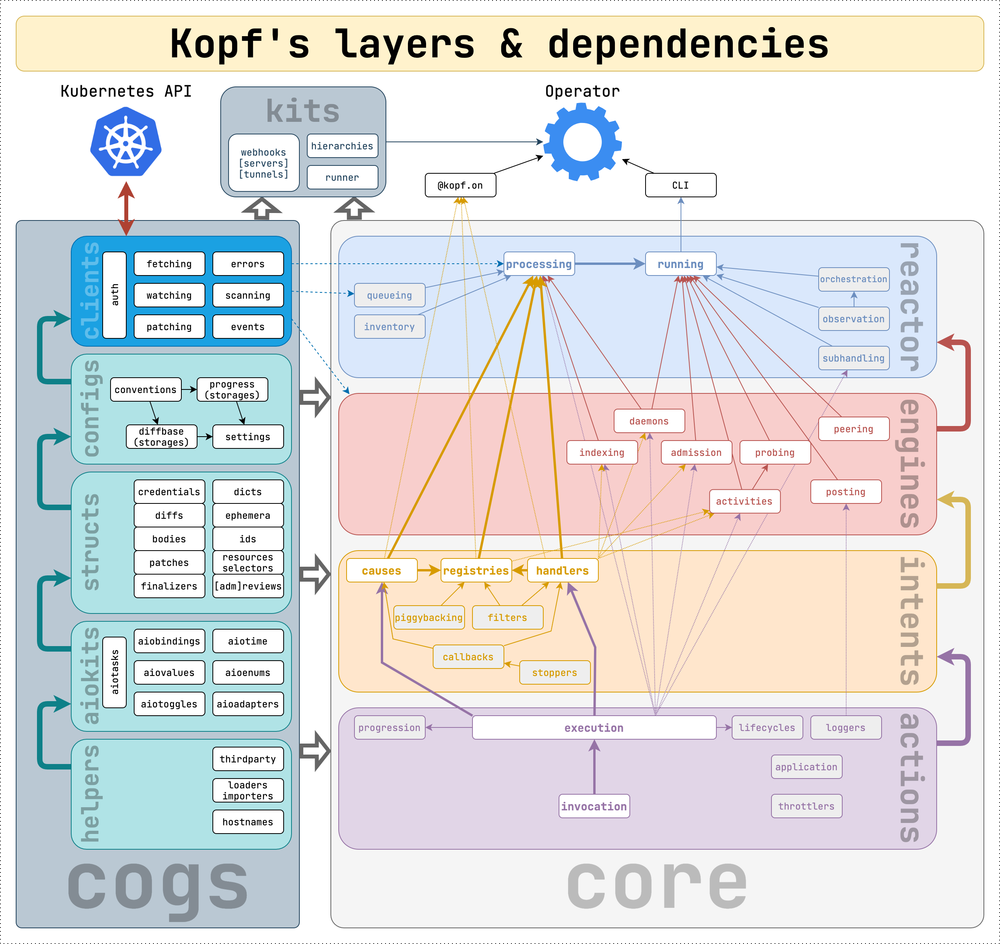

============
Architecture
============

Layered layout
==============

The framework is organized into several layers, which are themselves layered.
Higher-level layers and modules can import the lower-level ones,
but not vice versa. `import-linter`_ checks and enforces the layering.

.. _import-linter: https://github.com/seddonym/import-linter/

   The figure shows only the essential module dependencies, not all of them.
   Cross-layer dependencies represent all the many other imports.

.. Drawn with https://diagrams.net/ (ex-draw.io; desktop version).
.. The source is here nearby. Export as PNG, border width 0, scale 200%,
.. transparent background ON, include copy of the diagram OFF.

Root
----

At the topmost level, the framework consists of cogs, core, kits,
and user-facing modules.

``kopf``, ``kopf.on``, and ``kopf.testing`` are the public interface that can be
imported by operator developers. Only these public modules carry public
guarantees on names and signatures. Everything else is an implementation detail.

The internal modules are intentionally hidden (by underscore naming)
to discourage taking dependencies on implementation details
that may change without notice.

``cogs`` are utilities used throughout the framework in nearly all modules.
They do not represent the main functionality of operators, but are needed
to make them work. Generally, cogs are fully independent of each other
and of the rest of the framework --- to the point that they could be extracted
as separate libraries (in theory, if anyone needed it).

``core`` is the main functionality used by a Kopf-based operator.
It sets the operators in motion. The core is the essence of the framework;
it cannot be extracted or replaced without redefining the framework.

``kits`` are utilities and specialised tools provided to operator developers
for specific scenarios and settings. The framework itself does not use them.

Cogs
----

``helpers`` are system-level or language-enhancing adapters: for example, hostname
identification, dynamic Python module importing, and integrations with third-party
libraries (such as pykube-ng or the official Kubernetes Python client).

``aiokits`` are asynchronous primitives and enhancements for ``asyncio``,
sufficiently abstracted from the framework and the Kubernetes/operator domain.

``structs`` are data structures and type declarations for Kubernetes models:
resource kinds, selectors, bodies and their parts (specs, statuses, etc.),
admission reviews, and so on. This also includes some specialised structures,
such as authentication credentials --- also abstracted from the framework even
if the clients and their authentication are replaced.

``configs`` are mostly settings, and everything needed to define them:
e.g. persistence storage classes (for handling progress and diff bases).

``clients`` are the asynchronous adapters and wrappers for the Kubernetes API.
They abstract away how the framework communicates with the API to achieve
its goals (such as patching a resource or watching for its changes).
Currently, this is based on aiohttp_; previously, it used the official Kubernetes
client library and pykube-ng. Over time, the entire client implementation
can be replaced with another --- while keeping the signatures for the rest
of the framework. Only the clients are allowed to talk to the Kubernetes API.

.. _aiohttp: https://github.com/aio-libs/aiohttp

Core
----

``actions`` is the lowest level in the core (but not in the framework).
It defines how functions and handlers are invoked, which ones specifically,
how their errors are handled and retried (if at all), and how the function results
and patches are applied to the cluster, and so on.

``intents`` are mostly data structures that store the declared handlers
of the operators, plus some logic to select and filter them when a reaction
is needed.

``engines`` are specialised aspects of the framework, i.e. its functionality.
Engines are usually independent of each other (though this is not a rule).
Examples include daemons and timers, validating/mutating admission requests,
in-memory indexing, operator activities (authentication, probing, etc.),
peering, and Kubernetes ``kind: Event`` delayed posting.

``reactor`` is the topmost layer in the framework. It defines the entry points
for the CLI and operator embedding (see :doc:`/embedding`) and implements
task orchestration for all engines and internal machinery.
The reactor also observes the cluster for resources and namespaces,
and dynamically spawns and stops tasks to serve them.

Kits
----

``hierarchies`` are helper functions to manage hierarchies of Kubernetes
objects: labelling them, adding and removing owner references,
name generation, and so on. They support raw Python dicts as well as selected
libraries: pykube-ng and the official Kubernetes client for Python
(see :doc:`/hierarchies`).

``webhooks`` are helper servers and tunnels to accept admission requests
from a Kubernetes cluster even when running locally on a developer's machine
(see :doc:`/admission`).

``runner`` is a helper that runs an operator as a Python context manager,
mostly useful for testing (see :doc:`/testing`).
